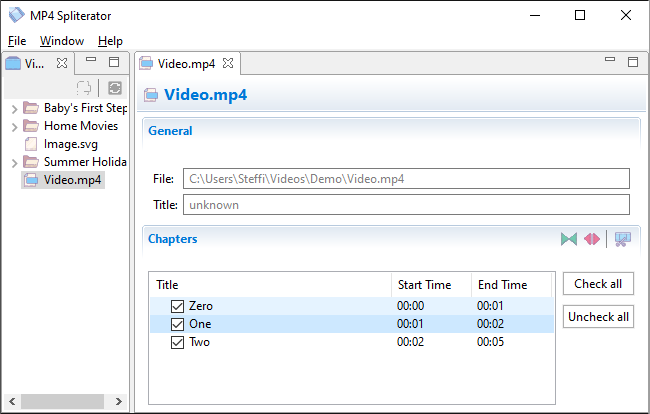

# MP4 Spliterator

 

- **Author:** [Stef Schulz](mailto:s.schulz@slothsoft.de)
- **Repository:** <https://github.com/slothsoft/mp4-spliterator>
- **Open Issues:** <https://github.com/slothsoft/mp4-spliterator/issues>
- **User Manual:** [Hosted on GitHub](https://slothsoft.github.io/mp4-spliterator/)

An application for splitting MP4 files into chapters: 

**Content of this ReadMe:**

- [Getting Started](#getting-started)
- [Features](#features)
- [Versions](#versions)
- [Third Party Libraries](#third-party-libraries)
    - [Icons](#icons)
    - [MP4](#mp4)
- [License](#license)

## Getting Started

### Prerequisites

You need at least an installed **Java 8** or above to run the code. You can download it from [java.com](https://www.java.com/download/).

### Installing

Just download the last release and extract it in a folder of your choice, then double click the EXE file.

### Using the Application

Splitting an MP4 into chapters is an easy process which can be done in very 
little clicks:

<ul>  
	<li>1st a) Double click on a video in the <b> Video Folder</b>. </li>
	<li>1st b) <i>Or</i> open a video directly via the menu <i>File →  Open Video</i>. </li>
	<li>2nd The video will be opened in a separate section where you can check and uncheck the chapters.</li>
	<li>3rd Click <b> Export Chapters Separately</b> and choose a folder. The chapters will be exported into this folder.</li>
</ul>

*(More information can be found in the  [user manual](https://slothsoft.github.io/mp4-spliterator/).)*

##  Features

If something is missing, request it via [a new issue](https://github.com/slothsoft/mp4-spliterator/issues/new).

##  Versions

| Version       | Issues | Changes       | Download      |
| ------------- | ------ | ------------- | ------------- |
| Future | [Issues](https://github.com/slothsoft/mp4-spliterator/issues) | | |
| 1.0.0 | [Issues](https://github.com/slothsoft/mp4-spliterator/milestone/1?closed=1) | first prototype | [Download](https://github.com/slothsoft/mp4-spliterator/releases/tag/1.0.0)

## Third Party Libraries

### Icons

Application icons are from [icons8](https://icons8.de/). The flags in the README are from [H. J. Nilsson](https://github.com/hjnilsson/country-flags).

### MP4

To get the meta data from MP4 files, [mp4parser](https://github.com/sannies/mp4parser) is used. Since this library doesn't support reading chapter files (yet), I tried implementing it with the help of the [official spec](https://www.adobe.com/content/dam/acom/en/devnet/flv/video_file_format_spec_v10.pdf) ("chpl" box, page 30).

Example files are from [here](http://techslides.com/sample-webm-ogg-and-mp4-video-files-for-html5).

## License

This project is licensed under the MIT License - see the [MIT license](LICENSE) for details.
